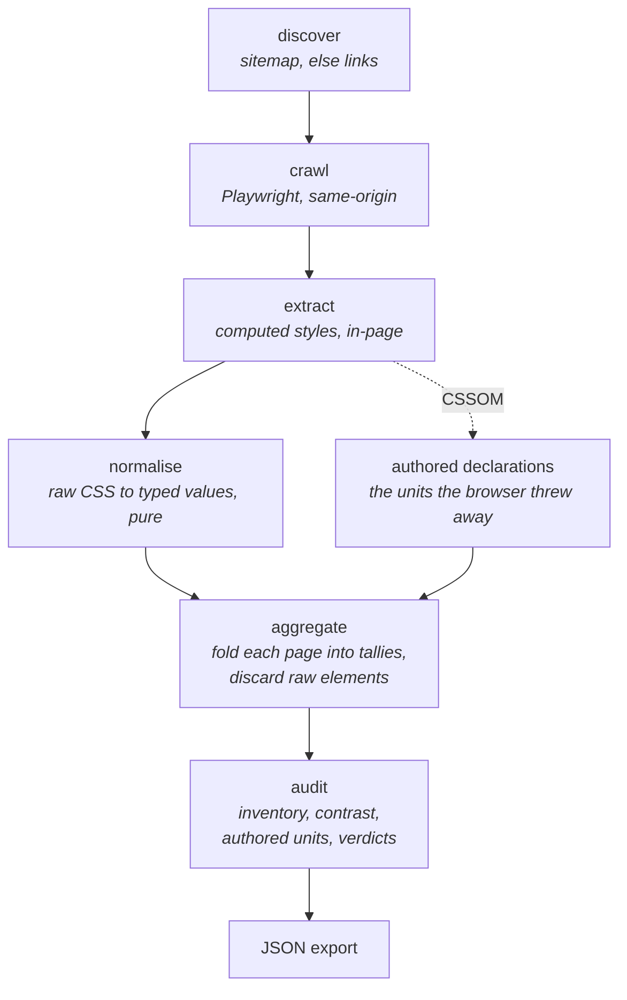
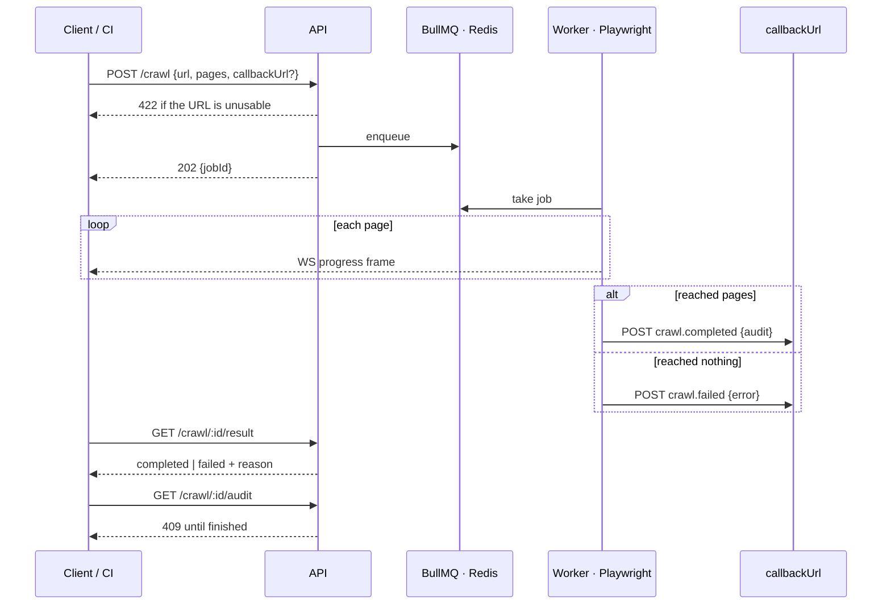

# Drift — design

How Drift is put together and why. The architecture first, then the decisions
behind it, then the one layer that was built and deliberately removed.

One constraint runs through all of it: Drift is a **deterministic pipeline over a
slow, failure-prone crawl of a site you don't control**. Every choice that keeps
that path computed, memory-bounded, and legible wins over a heavier one that
would add capability. (The agentic drift-classification work some of these
decisions once anchored — pause/resume at a human checkpoint — has moved to
`loom`.)

---

## What Drift is

Point Drift at a live URL you don't control. It crawls the site and audits the
design system that was *actually shipped* — every colour, typeface, size, radius,
shadow, border and spacing value in use, deduplicated, perceptually grouped, and
attributed to the pages it appears on.

It answers one question completely: **what is this system, really?** The
inventory is the evidence, the verdicts are the diagnosis, and the JSON export is
the takeaway.

Everything runs **without an API key**. The crawl, the aggregation, the verdicts
and the export are all computed — no model in the loop, no per-run cost, and the
same site audited twice gives the same answer. Measuring a system against a
stated reference is arithmetic.

Judging whether a *change* between two versions is intentional or accidental is a
different problem — it needs two sides to compare and is genuinely judgemental.
That work lives in `loom`, not here.

---

## How it works

One thing worth noting in that chain: **extraction reads twice** —
`getComputedStyle` for what the browser resolved, and the CSSOM for what the
author actually wrote. The second read is what makes authored units recoverable.

Aggregation currently happens *after* the crawl, over the retained extractions.
Memory is therefore bounded by the page cap rather than by the work itself —
see the crawl-reliability decision below for why that is a known limit and what
replaces it.

---

## Crawl scope

Crawling costs three things, so "crawl everything" is never offered unbounded:

| Cost | Why it matters | Mitigation |
|---|---|---|
| Time / compute | Each page is a headless navigation + DOM walk (~1–4s) | BullMQ concurrency; a hard page cap |
| Memory | Every element of every page is retained until the audit runs, so one animation-heavy page can exhaust the heap alone | A modest page cap and a per-page element ceiling; incremental aggregation is the documented fix |
| Politeness | Full-crawling a site you don't own is rude and gets you blocked | Same-origin only; a modest cap |

There are also **diminishing returns**. The design language lives in the shared
stylesheet, so a handful of pages captures the system; pages 6→N mostly repeat
tokens already seen. What extra pages buy is *attribution* — "this off-brand red
only appears on `/careers`" — not new tokens.

**The cap is `MAX_CRAWL_PAGES = 10`**, enforced server-side and mirrored in the
picker. Callers either name the pages to visit (the discovery picker) or omit
them and get a same-origin breadth-first walk from the root. Per-page attribution
is kept in both modes; it costs only a set of page URLs per token.

---

## What the audit reports

Usage frequency is the core signal: a value used once is noise, a value used 400×
is a token. Everything is ranked by usage, deduplicated, and attributed to pages.

| Category | How it aggregates |
|---|---|
| Colour | Tallied by role (text / background / border) and page, then clustered by CIEDE2000 via `@haus/colour-utils`; near-duplicates and opacity variants are distinguished |
| Contrast | Every distinct text/background pair with its WCAG ratio and AA/AAA verdict, worst first |
| Typography | Families, the size set with weights and line-heights, and the real role→size map read from element tags |
| Spacing | Distinct padding / margin / gap values, quantised and deduplicated |
| Radius · Shadow · Border | Distinct values with usage and element attribution |
| Z-index · Opacity · Blur · Gradients · Motion · Breakpoints | Collected where present; absent categories simply do not appear |

On top of the inventory sits the **diagnosis** — a plain-language health line and
a verdict per category (good / watch / review). Every claim is measured against a
stated reference: a named modular ratio for type, a 4px or 8px grid for spacing,
CIEDE2000 for colour, WCAG 2.1 for contrast. The reference is **selectable**, so
the reader can ask "how far are we from a major third?" rather than only being
told which scale they happen to sit on.

### Authored units

`getComputedStyle` returns **resolved px** — the browser has already collapsed
whatever was authored (`rem`, `em`, `%`, `clamp()`) into one number. That is lossy
in two ways that matter:

- **Unit-blindness.** A rem-authored site reads as a pile of px, and sub-pixel
  resolution artefacts (`1.96195px` vs `1.96209px` — one `0.125rem` resolved in
  two contexts) get promoted to distinct "tokens". Only `rem` is recoverable from
  px; `em`, `%` and `clamp()` are gone.
- **Declared tokens ignored.** Sites increasingly ship `:root { --color-primary }`
  themselves. Those are the site's *real* token names, and they are sitting in the
  stylesheet.

So the extractor also walks the CSSOM for authored declarations and custom
properties. The audit then reports the dominant unit per category, leads each
scalar table with the unit the site actually authors in, and flags `font-size`
authored in `px` as an accessibility risk — it won't respect user zoom.

Resolved values are quantised deterministically before any of this, and
near-identical values cluster into one representative weighted by usage.

**Not built:** multi-viewport crawling (one width, so the responsive system is
invisible) and interactive states (`getComputedStyle` sees only the resting
state, and captures whatever JS has set inline at crawl time).

---

## Service contract

The backend is a standalone service, not a UI helper — the client is one consumer
of the same API a CI job would use.

The shape decisions worth stating:

- **Crawls are jobs, not requests.** A capped Playwright crawl runs for minutes,
  so `POST /crawl` returns `202 {jobId}` and the work happens on the queue.
- **Two channels, one authority.** WebSocket frames carry progress for liveness;
  `/crawl/:id/result` is the authoritative completion signal. A dropped socket
  degrades to polling rather than hanging the UI.
- **Validation at the edge.** `/crawl` rejects an unusable URL with `422` rather
  than queueing a job that can only fail, matching `/discover`.
- **Zero pages is a failure.** A crawl that reached nothing returns
  `status: "failed"` with the reason, and `/audit` returns `409` — an unreachable
  site must never read as a successfully audited empty one.
- **Webhooks are best-effort and guarded.** The callback URL is caller-supplied,
  so it is an SSRF vector: it must be public http(s), and the host is resolved
  before the check because a public name can still point at `127.0.0.1`. Delivery
  retries a `5xx`, gives up on a `4xx`, and never fails a crawl that succeeded.

Endpoints are documented in [README.md](README.md).

---

# Decisions

Recorded to explain the *why* — not as immutable rules, but so future changes are
made with full awareness of what they replace.

## Architecture

### Backend framework: standalone Node + Express over Next.js API routes

Core and hipuku.dev are Next.js apps, so Next was the default to beat. It loses here for a structural reason, not a preference one. Drift needs three things that want a single long-lived process: a persistent WebSocket connection feeding live crawl progress, Playwright workers driving headless Chromium, and BullMQ workers pulling jobs off a queue. Next.js API routes are request-scoped and, in their natural deployment target, serverless — there is no durable process to own a WebSocket server or a worker pool, and cold starts actively fight against both. Running Next purely as a custom server to host all this would be using the framework for none of the things it is good at while inheriting its constraints. Express is a thin, well-understood process that does exactly one job: stay alive and own the sockets and the queue workers. The frontend is a separate Vite SPA (see below), so there is no SSR requirement pulling back toward Next.

Confidence: High.

### Frontend: Vite SPA over Next.js

Drift's frontend is a single surface — crawl configuration, a live progress view, the audit, and the proposals. There are no public, SEO-relevant, server-rendered pages; the valuable output is generated per-run and streamed, not statically rendered. That removes the main reasons to reach for Next. A Vite + React SPA talking to the Express API over HTTP and WebSocket keeps the two halves cleanly separated and the build fast. It also makes the architecture legible at a glance: a server process and a client process, no blurred middle.

Confidence: High.

### Job queue: BullMQ over pg-boss and in-memory

A crawl is slow, failure-prone, and must not run on the request thread — it needs a real queue with retries, concurrency limits, and progress reporting. Three options were weighed. An **in-memory queue** was rejected immediately: it cannot survive a restart, and a queued crawl should outlive one. **pg-boss** (Postgres-backed) is appealing for keeping the dependency count down, but it would add a second stateful store, and **BullMQ** — the mature Redis-backed queue — brings first-class concurrency control, retry/backoff, and an events stream that maps naturally onto the per-page WebSocket progress updates. One Redis, one queue, no extra database.

Confidence: High.

### Real-time transport: WebSockets over SSE

A crawl emits progress continuously — pages visited, elements seen, token tallies growing — and the UI shows it live. Both Server-Sent Events and WebSockets serve one-directional progress streaming well, so the original tie-breaker (the bidirectional agent checkpoint) is gone with that layer. WebSockets remain the deliberate choice for two standing reasons: the duplex channel leaves room for the interactive crawl controls the product moves toward (pause, cancel, adjust scope mid-run) over one connection rather than a second POST channel bolted on later, and the long-lived server that terminates the socket is already required by the Express decision above, so WS adds no new infrastructure.

Confidence: High on keeping WebSockets. The honest caveat: if Drift were frozen as pure fire-and-forget progress with no client→server interaction, SSE would be marginally simpler — but that is not the direction, and the transport is not worth re-plumbing to save little.

### Infrastructure built in isolation, one new piece at a time

Drift combines BullMQ, WebSockets, Playwright, and Redis. The failure mode is integrating them together and being unable to tell which layer broke. The rule: build each piece standalone and add at most one new infrastructure dependency per step. Order — Playwright crawler + CSS extraction with no queue and no UI; then `colour-utils` clustering as a pure function; then BullMQ + Redis around the crawler; then the WebSocket layer; then Docker. Each step is independently testable, and a regression points at exactly one newly added piece.

Confidence: High.

### Docker multi-stage build to contain the Chromium binary

**Status: planned, not built** — there is no Dockerfile in the repo yet. Recorded because it is the intended shape and it gates the CI story.

Playwright's Chromium adds roughly 300MB to an image if installed naively. The Dockerfile is multi-stage and installs only the Chromium browser (`playwright install chromium`, not the full browser set), keeping the runtime image as lean as a Chromium-bearing image can be. A `docker-compose.yml` would bring up the backend plus Redis for local development so the full stateful stack runs with one command. This also sets up the CI story: the same Redis runs as a service container in GitHub Actions, the test suite exercises real Redis and real BullMQ, and the Docker build/push runs only after tests pass.

Confidence: High on the shape; unbuilt, so unproven.

### @haus/colour-utils is linked into the client, with a type shim

The colour proposal re-clusters live as the user moves the size slider, so the CIEDE2000 and WCAG maths has to run in the browser. Reimplementing CIEDE2000 client-side would be duplicated, error-prone colour science, so the package is linked into the client the same way it is into the server. It is pure ESM with one browser-safe dependency and no Node builtins.

It ships TypeScript source rather than built declarations, which the client's stricter compiler options reject, so the client carries a declaration shim mirroring the server's: tsconfig `paths` points type resolution at the shim while Vite, which ignores tsconfig paths, bundles the real source. Both shims disappear when the package publishes built declarations.

Confidence: High, though the shim is a bridge and is documented as one in both copies.

---

## Extraction and the audit

### Audit reads authored CSS, not only computed styles

The first audit read every value from `getComputedStyle`, which returns resolved px. It was fast and truly "as rendered", but lossy in four ways at once: it discards the authored unit (a `rem`-based system reads as a pile of px, and one authored value resolves to several sub-pixel-different "tokens" like `1.96195px` vs `1.96209px`), it ignores the site's own declared `--*` custom properties, it sees only one viewport and only the resting state, and it captures JS-set inline noise (e.g. a GSAP frame). You cannot recover `em`/`%`/`vw`/`clamp()` from a px number — only `rem` is derivable (`px ÷ root font-size`) — so the fix is to read the CSS source (CSSOM) alongside the computed pass, which `extractBreakpoints` already proves is feasible. Computed styles stay the truth of *what rendered*; authored CSS supplies *what was written*, the real token names, and the interactive states. The proposal depends on this: off-scale / off-grid judgments are invalid on the wrong unit, so units land in the audit before any proposal, and the proposal recommends a unit per category (type in `rem` for zoom accessibility).

Confidence: High on the direction. Medium on per-element rule matching — the pragmatic route collects declared token sets per property rather than resolving the full cascade per element.

### Crawl reliability: incremental aggregation over a raised page cap

A crawl OOM'd the backend on a real content site, then crash-looped as BullMQ retried the poison job off Redis. The cause is not the page count — the pipeline retains every element of every page, so one animation-heavy page (tens of thousands of nodes) can exhaust the heap on its own. The fix is incremental aggregation (fold each page into token tallies, discard its raw elements) so memory scales with the number of *distinct tokens*, not elements × pages; plus a per-page element ceiling to cap a single monster page and a modest hard page cap.

**What shipped:** the per-page element ceiling (`MAX_ELEMENTS = 12,000`) and the page cap, now `MAX_CRAWL_PAGES = 10`, down from 40. **Incremental aggregation is not built** — the pipeline still retains every extraction and audits at the end, so the page cap is doing the memory work. Raising the cap meaningfully requires the refactor first. "Crawl all pages" is not the goal: the design language lives in the shared stylesheet, so a handful of pages captures the system and more pages only add per-page attribution — the scope picker should say so.

Confidence: High on the diagnosis. The cheap half shipped; the refactor is the outstanding half.

### The reference a value is measured against is selectable

"Off-scale" is meaningless without saying *off what*. The type ruler compares the site's sizes against any named modular ratio and the spacing ruler against a 4px or 8px grid, with each option carrying its own off-count so the strip answers "which scale is this system actually on?" before anything is picked. The automatic pick is ranked by *fewest values off*, tie-broken by mean relative error — ranking by error alone could crown a ratio that fits most sizes tightly but tips two over tolerance, leaving the option labelled "closest" showing a higher count than its neighbours.

The selection drives that section's ruler and table together, but never the Overview verdict, which stays pinned to the automatic best fit. Otherwise exploring a hypothesis would rewrite the diagnosis, and a reader who tried Golden Ratio out of curiosity would be told their type system is failing.

Confidence: High. It turns a fixed assertion into a measurement with a stated reference.

## The API surface

### The export leads with the diagnosis, not the inventory

The export has one real audience — machines: a CI check to assert on, two runs to diff, a model to reason over. Shipping raw counts made the consumer re-derive the judgement Drift had already made. It now leads with `health` (the same sentence the report shows), `findings[]` (typed, with severity and the evidence behind each), `verdicts`, and a `rules` block stating the ΔE threshold, grid base, detected ratio, and WCAG standard, so the numbers are anchored to what they were measured against. The full inventory sits underneath as evidence.

Confidence: High. The diagnosis is the product; the inventory is its working.

### A crawl that reached nothing is a failure

A crawl visiting zero pages once reported `completed` and served an all-zeros audit. The screen compensated, but anything reading the API directly was told an unreachable site had been audited successfully. The job now fails and carries the worker's reason, so the failure screen can name which of unreachable / blocked / nothing-there happened. `/crawl` likewise validates the URL at the edge rather than queueing a job that can only fail, matching `/discover`.

Confidence: High. An API that reports success for an empty result cannot be built on.

---

# Cut: the proposals layer

A second layer projected the audited tokens onto known-good structures — a
consolidated palette merged by ΔE, a role-first modular type scale, a detected
4/8px spacing grid, a named radius ramp, an elevation ladder for shadows, and a
canonical z-index ladder — each with a Current↔Proposed preview and its own
export. It was deterministic throughout: every token it emitted was a value the
site already shipped.

It was cut so the product does one thing completely rather than two things
partly. The audit is a claim Drift can defend on its own evidence; a proposal is
a recommendation, and recommendations need a stronger warrant than "this is
arithmetically tidier". The code remains in git history and the reasoning is
kept in DESIGN.md as the v2 direction.

What survived the cut, because it belongs to measurement rather than
recommendation:

- **Selectable references.** "Off-scale" is meaningless without saying *off what*.
  The type ruler compares against any named ratio and the spacing ruler against a
  4px or 8px grid, each option carrying its own off-count, so the strip answers
  "which scale is this system actually on?" before anything is selected.
- **Perceptual clustering.** CIEDE2000 near-duplicate detection is a measurement,
  not a suggestion.
- **The export.** Reduced to one JSON artefact that leads with the diagnosis.

The decisions below governed that layer. They are kept because the reasoning
still holds and the layer is the documented v2 brief, not because the code ships
today.

The decisions below governed that layer. They are kept because the reasoning
still holds and it is the documented v2 brief, not because the code ships today.

### Proposals are reductive, never generative

Every token a proposal emits is a value the site already ships. Drift slims a palette or a scale down; it never invents a colour or a size. This replaces an earlier plan to generate an OKLCH tonal ramp from the primary colour. The reason is a product one, not a technical one: consolidating *preserves* the design and can be applied today, whereas generating a ramp *changes* the design and needs a level of buy-in a diagnostic tool has not earned. Mixing the two would make every output suspect, because the user could no longer tell which colours were theirs. Generation is kept as a possible future "Systematise" mode — explicitly opt-in, clearly labelled, never the default.

Confidence: High. This is the constraint that makes the output trustworthy.

### Colour merging is evidence-gated, not threshold-only

The first implementation clustered at CIEDE2000 ΔE 8 and named the result `color-1..N`. Both halves were wrong. ΔE 8 is intent-blind — it cheerfully merges a default and its hover state, because it only knows perceptual distance, not why two colours differ. Merging is now gated on three things together: the colours must be within ΔE 2 (at or below the just-noticeable difference, so the merge is invisible), they must be doing the same job, and neither may be an opacity variant of the other.

The same-job rule matters more than it first appears. Two colours a user cannot tell apart still deserve separate tokens when one is a border and the other a surface — they become two names sharing one value, which is how a real system expresses "the border happens to match the surface" without welding them together and losing the ability to change one later.

ΔE is exposed as a readout, not a control. A user does not arrive wanting a perceptual distance of 3; they want fewer colours.

Confidence: High on the gating. Medium on the default of 2 — real sites often need 3–5 before near-blacks collapse, which is why the control exists.

### Contrast reports what passes, not what fails

The obvious design — list the pairs that fail AA — was actively harmful. A twenty-token palette fails in most of its combinations, so the panel shouted about twenty problems that were not problems, because nobody was going to put that text on that background anyway. The real failures drowned in false alarms.

Inverting it fixes both halves at once. The same computation, reported as the combinations that *pass*, becomes a pairing guide: here is what you can safely use. Nonsense pairings disappear on their own, because they do not pass, so no heuristic is needed to filter them out. It also changes the emotional register from accusation to assistance, which suits a tool whose job is to help someone dig out of technical debt.

Confidence: High.

### Semantic naming: usage leads, contrast breaks ties

Names are inferred from what a colour is observed doing — its dominant role (text / background / border), how much of the site it carries, and whether it reads as a neutral or a hue. Usage leads because it is evidence of intent: a colour used as a background 697 times is a surface, whatever its contrast says.

Contrast is a tie-breaker only. When a colour's roles are genuinely split, contrast against the page background decides ink-versus-surface rather than leaving it to a coin flip. It never overrides clear usage.

Two failure modes were found on real data and fixed. Telling a neutral from a hue cannot use HSL saturation, which inflates at extreme lightness — a near-black with a faint cast computed to 0.155 and got named "info". Plain RGB spread has no such failure mode. And status names (success/warning/danger/info) are only considered when there are enough hue families to form a plausible set, because a site with one stray amber has a warm accent, or a warm brand, not a lone "warning".

The default matters even though names are editable, because the goal is to reduce the work the user has to do.

Confidence: Medium. The heuristics are defensible and now survive real sites, but naming is the one genuinely subjective step, which is why every name is editable in place.

### Type proposals are role-first; the modular ratio is optional

Drift crawls websites, and a website's type system is a semantic hierarchy — h1–h6, body, small, button — not an abstract modular ladder. Leading with ratios was an application mindset imported into a website tool.

The proposal now leads with the roles the site actually renders, at their real size and weight, in the site's own font, exported as semantic tokens. The modular ratio becomes an optional second step that regularises those roles onto even ratio steps anchored at body. This uses tag attribution the crawler already collected and the earlier proposal discarded, which is precisely the information generic type tools cannot have.

Proposed sizes round to whole pixels. A type token of 39.8px is nobody's idea of a clean scale, and rounding keeps the diff honest: only genuinely off roles move.

Confidence: High for websites. Would want revisiting if Drift ever targets web applications, where a tighter functional scale is more appropriate.

### Controls are expressed as outcomes, not mechanisms

An early colour proposal exposed a ΔE threshold picker, a contrast panel, a migration panel and dense token cards — six concepts deep, all in the tool's vocabulary rather than the user's. The correction generalises: a control should be measured in the unit the user cares about.

Palette size is therefore a slider measured in *tokens*, with ΔE shown only as a readout. Because several thresholds can produce the same palette, the ladder is precomputed and de-duplicated so every slider stop is a real change rather than a dead zone. Supporting detail is progressively disclosed — contrast collapses to one line that opens a rail, and the migration map lives in Export, because it is a takeaway artefact rather than something to study on the page.

Two personas justify the split: the inheritor, who owns a site they did not build and wants an answer, and the systems owner, who wants control and evidence. The screen must rest quiet for the first and open up for the second.

Confidence: High on the principle. The per-merge override the systems owner really wants ("keep these two apart") is still unbuilt; the global control covers most cases.

### Proposals derive from the audit, not from separate endpoints

Colour and type proposals originally fetched their own inventories. Both now read from the audit payload, as spacing, radius, shadow and z-index always did. The audit already carries the role and tag attribution the good proposals depend on, so the separate endpoints were both a round-trip and a second, weaker source of truth. Two fetches disappeared and every proposal now has access to the same evidence.

Confidence: High.
