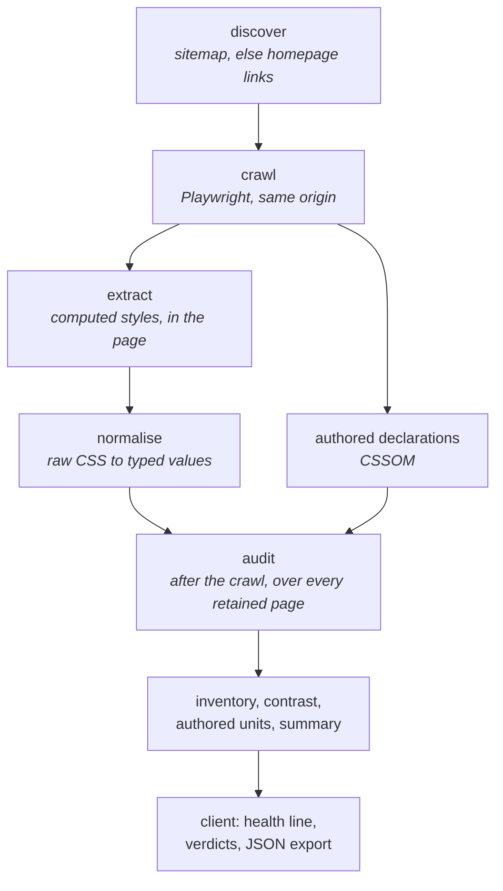
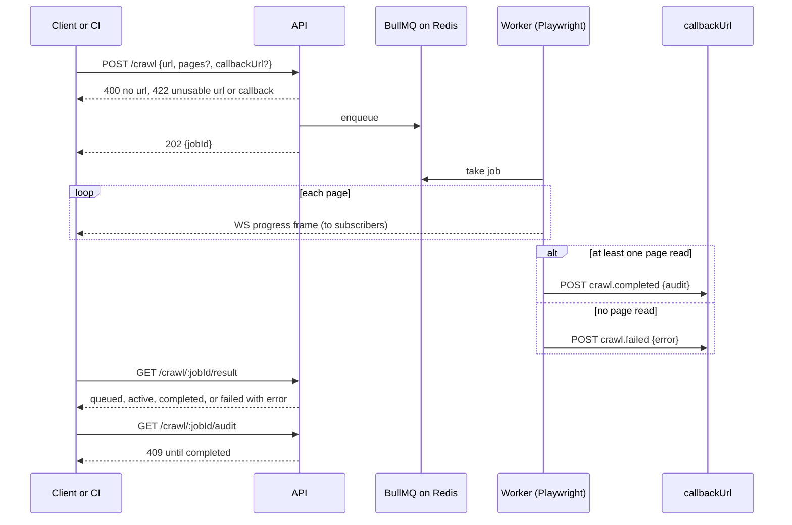

# Drift: design notes

The architecture, the service contract, the token layer, the decisions behind them, and what is
not built.

---

## What Drift is

Drift crawls a website and reports the design values it ships. Every colour, typeface, size,
radius, shadow, border and spacing value in use is deduplicated, grouped perceptually and
attributed to the pages it appears on. A health line and a verdict per category sit on top of
that inventory, and a JSON export carries both.

The crawl, aggregation, verdicts and export are computed. Drift calls no model API, needs no key,
and gives the same audit for the same pages. Comparing two versions of a system and judging
whether a change was intended is out of scope.

---

## Architecture



Each page is read twice. `getComputedStyle` gives the resolved values, and the CSSOM gives the
declarations as written, which is where authored units and custom properties come from.

The audit runs once, after the crawl, over the extraction of every page. Memory therefore grows
with elements times pages, and the page cap bounds it. See
[Crawl reliability](#crawl-reliability-the-page-cap-now-incremental-aggregation-later).

### Processes

One Node process runs the Express API, the WebSocket server and a BullMQ worker with concurrency
2. Redis holds the queue. The React client is a separate Vite build.

The queue runs each job once (`attempts: 1`) and fails a stalled job instead of retrying it
(`maxStalledCount: 0`). Completed jobs are kept for an hour or the last 100, failed jobs for a
day.

### Discovery

`POST /discover` resolves the input to a reachable URL, trying the host with and without `www.`.
It then reads `Sitemap:` lines from `robots.txt`, or tries `/sitemap.xml`, `/sitemap_index.xml`
and `/wp-sitemap.xml`, and follows sitemap indexes up to 15 documents and 500 URLs. Author,
category, tag, feed, `wp-` and dated-permalink paths are dropped. With no sitemap it loads the
homepage in Playwright and lists same-origin links, grouped by path, without action endpoints such
as `vote` or `login`. The list is capped at 1,000 pages.

### Crawl scope

| Cost | Cause | Current limit |
|---|---|---|
| Time | Each page is a headless navigation and a DOM walk | Worker concurrency 2, page cap |
| Memory | Every element of every page is kept until the audit runs | Page cap only |
| Load on the site | Requests to a site the operator does not own | Same origin only, page cap |

`MAX_CRAWL_PAGES` is 10, enforced by the server and mirrored in the page picker. A caller either
names the pages or omits them and gets a breadth-first walk of same-origin links from the root.
A URL counts as same origin when its parsed origin equals the root's. Each page gets 30 seconds
to reach `domcontentloaded`, and a page that fails is logged and skipped.

Most values come from shared stylesheets, so a few pages find most of a site's values. More
pages add attribution, such as a red that appears only on `/careers`.

---

## Data model

A crawl produces a `CrawlResult`: the root URL, a timestamp, and per page the URL, title, element
count, normalised elements, breakpoints and authored declarations. `collectAudit` turns it into a
`SiteAudit`. Both are in `openapi.yaml`.

| `SiteAudit` field | Contents |
|---|---|
| `summary` | Pages, distinct colours, colour families, near-duplicate colours, font families, type sizes, weights, sizes off the fitted scale, spacings, spacings off the 4px grid, radii, near-duplicate radii, shadows, contrast pairs, pairs failing AA |
| `colourFamilies` | Swatches by hue family: hex, count, roles, elements, pages, OKLCH lightness, nearest other colour, related colours |
| `typography` | Families, the size used by each element role, sizes with weights and tags, weights, line heights, letter spacings |
| `spacing`, `radius`, `shadow`, `borders` | Distinct values with counts, and tags or properties |
| `opacity`, `zIndex`, `blur`, `gradients`, `motion`, `breakpoints` | Present when the site uses them |
| `authored` | Dominant unit for spacing, font size, radius and border width, the site's own custom properties, and whether font size is mostly `px` |
| `contrast` | Distinct text and background pairs, with ratio, AA, AAA and large-text AA results, count, tags and pages, lowest ratio first |

Colour clustering and WCAG ratios come from `haus-colour-utils`: CIEDE2000 for distance and near
duplicates at ΔE below 2, and OKLCH hue for families.

The health line, the per-category verdicts (good, watch, review) and the export are computed in
the client from `SiteAudit`. They are not on the API.

### Authored units

`getComputedStyle` returns pixels. A site authored in `rem` reads as pixels, and one `rem` value
resolved in two contexts can come back as two values, such as `1.96195px` and `1.96209px`. It
also ignores custom properties a site declares on `:root`.

The extractor walks the CSSOM of every same-origin stylesheet. Cross-origin sheets throw on
`cssRules` and are skipped. For font size it reads `font-size` only: line height is usually
unitless and letter spacing usually `em`, and counting them would move the dominant type unit and
the `px` flag.

---

## Service contract



- **Completion comes from `/result`.** WebSocket frames report progress. The client polls
  `/crawl/:jobId/result` for completion, so a dropped socket does not stall the UI.
- **Unusable URLs are refused before a job exists.** Both `/discover` and `/crawl` return `422`
  for a URL that cannot name a site: an explicit scheme other than http(s), or a host with no dot.
- **A crawl that reads no page fails.** The job ends `failed` with a reason, and `/audit` stays
  `409`.
- **Callbacks are checked at enqueue.** See [Webhooks](#webhooks).

### Endpoints

| Method | Path | Purpose |
|---|---|---|
| `POST` | `/discover` | Resolve a URL and list candidate pages |
| `POST` | `/crawl` | Enqueue a crawl. `202 { jobId }` |
| `GET` | `/crawl/:jobId/result` | Job status, the crawl result once completed, the reason once failed |
| `GET` | `/crawl/:jobId/audit` | The audit of a completed crawl |
| `WS` | any path | Progress for the jobs a connection subscribes to |

The full contract, including the webhook callbacks, is [`openapi.yaml`](openapi.yaml) (OpenAPI
3.1). `src/server/contract.test.ts` validates the app's responses against it.

#### Discover

```http
POST /discover
{ "url": "picocss.com" }
```

```json
{
  "rootUrl": "https://picocss.com/",
  "host": "picocss.com",
  "via": "links",
  "pages": [{ "path": "/", "url": "https://picocss.com/", "title": "Home" }]
}
```

`rootUrl` is the resolved URL, after redirects and the `www.` check. Crawl requests should use it
instead of the input.

A missing or empty `url` is `400`. A URL that cannot name a site, or a site that cannot be read,
is `422` with an `error` message. drift-tests uses the `400` as its readiness probe because it
involves no Redis, Playwright or network, so changing that status would break the probe.

#### Crawl

```http
POST /crawl
{
  "url": "https://picocss.com/",
  "pages": ["https://picocss.com/", "https://picocss.com/docs"]
}
```

Page URLs must be absolute and on the root's origin. Others are dropped. If none remain, the
crawler walks links from the root instead. With `pages` present, the page limit is the number of
pages sent; without it, `maxPages` is used. Both are capped at 10.

The response is `202 { "jobId": "24" }`.

#### Job status

```http
GET /crawl/:jobId/result
→ { "status": "completed", "result": { "rootUrl": "…", "pages": [ … ] } }
```

`status` is `queued`, `active`, `completed` or `failed`. BullMQ's `waiting`, `delayed`,
`prioritized` and `waiting-children` are reported as `queued`. A job BullMQ no longer holds is
`404`. A crawl that read no page is `failed`:

```json
{ "status": "failed", "result": null, "error": "Couldn't read any pages. The site may be slow to load, blocking automated visits, or the selected pages may no longer exist." }
```

`GET /crawl/:jobId/audit` is `409` until the job is `completed`.

#### Webhooks

A `callbackUrl` on `POST /crawl` receives the result when the job ends.

```http
POST /crawl
{ "url": "https://picocss.com/", "callbackUrl": "https://ci.example.com/drift" }
```

```json
{
  "event": "crawl.completed",
  "jobId": "24",
  "site": "https://picocss.com/",
  "audit": { "summary": { "pages": 2, "contrastFailingAA": 0, "…": "…" }, "colourFamilies": [ … ], "contrast": [ … ] }
}
```

A failed crawl sends `crawl.failed` with an `error`. Every delivery has an `x-drift-event` header.
When `DRIFT_WEBHOOK_SECRET` is set it also has `x-drift-signature: sha256=<hex>`, the HMAC-SHA256
of the raw body.

The callback URL is checked when the crawl is enqueued, and a refusal is `422`. It must be http or
https, and every address its host resolves to must be public. Refused: `0.0.0.0/8`, `10/8`,
`100.64/10`, `127/8`, `169.254/16`, `172.16/12`, `192.168/16`, `224/4` and above, `::`, `::1`,
`fc00::/7`, `fe80::/10`, `ff00::/8`, and IPv4-mapped IPv6 addresses in those IPv4 ranges. A host
listed in `DRIFT_WEBHOOK_ALLOWED_HOSTS` (comma-separated, empty by default) skips the address
check. drift-tests allowlists `127.0.0.1` to receive deliveries.

Delivery makes up to three attempts, 10 seconds each, 500ms and then 1s apart. A network error, a
timeout or a `5xx` is retried. A `3xx` or `4xx` ends delivery: redirects are not followed, because
the redirect target was never checked. A failed delivery is logged to stderr and does not fail the
crawl; the audit stays on the API.

The webhook audit carries `summary` counts and `contrast` verdicts, enough for a CI job to fail a
build on a threshold. The health line and findings are built in the client and are not in the
payload.

#### Live progress

A WebSocket client sends `{ "type": "subscribe", "jobId": "24" }` and receives `subscribed`, then
`progress` frames (`pagesCrawled`, `maxPages`, `lastUrl`, `lastTitle`, `lastElements`,
`elementsTotal`), then `completed` or `failed` with a reason. The server forwards BullMQ
`QueueEvents`, so the worker can run in another process.

---

## Design system

Drift defines every custom property it reads. It read `haus-tokens` from 2026-08-30 to
2026-09-09. Eight cascade layers, in three groups, lowest first:

- **`foundation.*`** (`tokens/foundation.css`): primitives, brand inputs, motion values and
  semantic roles. 197 declarations, all `--drift-*`.
- **`base.*`** (`tokens/primitives.css`, `tokens/semantics.css`): five primitives and 15 roles
  Drift adds.
- **`drift.*`** (`styles/drift.css`): the theme. It maps surface, ink, border and primary onto a
  blue-slate neutral ramp and a blue accent ramp.

`tokens/layers.css` declares the order before any file opens a layer, so reordering the imports in
`main.tsx` does not change it. Components read roles, not primitives. The files in `tokens/` and
`styles/` are exempt from the hardcoded-value gate because they declare the values.

Not every name is prefixed. `foundation.css` is `--drift-*`; `primitives.css` and `semantics.css`
declare `--font-sans`, `--font-display`, `--font-mono`, `--space-hairline`, `--space-tight`,
`--radius-panel`, `--elevation-modal`, `--motion-duration-*` and `--type-data-*`, among others.

`semantics.css` declares 15 properties. Thirteen name something the foundation has no role for:
two elevation levels (modal, popover), three motion durations and an easing, a disabled-control
opacity, a panel radius, an inline icon size, two spacing insets below the 4px grid, and the two
tabular-data properties. The other two, `--drift-elevation-raised` and
`--drift-elevation-overlay`, override foundation roles of the same name so they point at Drift's
own `--shadow-*` ramp.

Spacing roles come in three kinds over one ladder: `inset` for padding, `gap` between siblings,
`stack` for margin in flow. Every spacing read in the client was on one of those three properties
when the roles were added, so the role follows from the property. The kinds can be retuned
separately.

`--space-hairline` (1px) and `--space-tight` (2px) sit below the 4px grid. They are used inside
small controls, where 4px is too much.

Z-index, border width and opacity follow the same two tiers as the rest: primitives
(`--drift-z-200`, `--drift-border-width-1`, `--drift-opacity-40`) and roles that alias them
(`--drift-z-modal`, `--drift-border-width-default`, `--drift-opacity-disabled`).

### Token tests

`client/src/tokens/tokens.test.ts` checks three things. `tokens/README.md` has the detail.

1. Every `var(--x)` without a fallback names a defined property. An undefined one is dropped at
   computed-value time and the property inherits, with no build error. `--duration-default` never
   existed and was read by five animations, which ran with no duration.
2. CSS modules read no primitive outside `TYPE_TIER_DEBT` and one decorative accent. The debt is a
   count per name, and a count that moves in either direction fails until the record moves too.
3. Every `@keyframes` name a CSS module uses is defined in that module.

The third was added on 2026-09-09. CSS Modules hashes keyframes names as it hashes class names.
The stylesheet split moved the motion tab's dots and the colour card's flash into their own
modules and left `slideTrack` and `cardFlash` in `Audit.module.css`, so neither animation ran. A
keyframes name is not a custom property, so the first check did not see it. `animation-name`
computes to the same string whether or not the keyframes exist, so the computed-styles e2e test
reported no difference before or after the fix.

A class used in a component and missing from its CSS module is not checked. It typechecks and is
`undefined` at runtime.

---

# Decisions

Why things are the way they are, recorded so a later change knows what it replaces.

## Architecture

### Express in a long-lived process, not Next.js API routes

Drift needs a WebSocket server, Playwright browsers and BullMQ workers, and all three need a
process that stays up. Next.js API routes are request-scoped and usually deployed serverless, with
no process to hold a socket or a worker pool, and cold starts on every idle period. Running Next as
a custom server would keep its constraints without using its rendering. Express holds the sockets
and the workers. The frontend has no server rendering to share.

### Vite and React, not Next.js, for the client

The client is one screen flow: configure, progress, audit. It has no public pages to render on the
server or index. A Vite SPA calls the API over HTTP and WebSocket, and builds in seconds.

### BullMQ, not pg-boss or an in-memory queue

A crawl runs for minutes and fails often, so it runs off the request thread in a queue with
concurrency control and progress events. An in-memory queue loses queued jobs on restart. pg-boss
would add Postgres beside Redis. BullMQ runs on Redis alone, and its progress events map onto the
WebSocket frames.

Retries are off (`attempts: 1`). A crawl that exhausted memory crashed the worker, and BullMQ
re-ran the same job on restart. See
[Crawl reliability](#crawl-reliability-the-page-cap-now-incremental-aggregation-later).

### WebSockets for progress

Server-Sent Events would carry one-way progress equally well. WebSockets were chosen because the
planned crawl controls (pause, cancel, change scope) need client-to-server messages, and the
Express process already exists to hold the socket. Today the client sends only `subscribe` and
`unsubscribe`. If those controls are dropped, SSE would be slightly simpler, and not worth the
change.

### One new infrastructure piece per step

The build order was: Playwright crawler and extraction with no queue; colour clustering as a pure
function; BullMQ and Redis; the WebSocket layer; Docker. Each step added one dependency, so a
failure pointed at that dependency.

### Docker: planned, not built

There is no Dockerfile. The planned image is multi-stage and installs Chromium only
(`playwright install chromium`), which adds about 300MB instead of the full browser set. A
`docker-compose.yml` would run the backend with Redis. CI already runs Redis as a service
container in drift-tests.

### Colour science from `haus-colour-utils`

CIEDE2000 distance, WCAG contrast, OKLCH conversion and the hue-family boundaries come from
`haus-colour-utils`, which ships ESM, CommonJS and types, with `chroma-js` as its one dependency.
The backend imports it. The client used to import it too, for a colour proposal that re-clustered
as a slider moved, through a hand-written type shim. The proposal was cut and the package now ships
built types, so the client import and the shim were removed.

The hue-family boundaries were first worked out in this repository, from the OKLCH hues of the
colours each family is named after. vault had used HSL boundaries and misnamed 17 of 27 reference
colours. The boundaries moved into the package in 0.2.1. In 0.3.0 they were refitted to 4,275
colours people named, because several families are not centred on their namesake.

### Drift defines its own tokens

**2026-09-09.** `haus-tokens` was removed and every property Drift reads is defined in the client.

Drift reports on other products' token layers. Styling it with the design system from the same
portfolio would make its own UI an instance of what it audits. It also tied Drift's appearance to
haus releases: the heading tracking change in `haus#37` reached Drift's UI through a version bump.

`tokens/foundation.css` was generated once from the installed `haus-tokens@3.2.0`: the properties
Drift read and the properties those read, renamed from `--haus-*` to `--drift-*`, without the
ruby, paper and cobalt ramps and without the roles Drift's theme overrides. It is edited by hand
now.

Two checks covered the change. The undefined-property test would name any property the generation
dropped. The computed-styles e2e test compared 2,680 elements against a baseline: 313 properties
differed, all from two earlier changes (the heading tracking in 3.2.0 and the Badge revert), and
none from the rename.

`haus-colour-utils` and `haus-style-probe` stay. They are analysis code, not a design system.

**Before this.** On 2026-08-30 the client took the primitive and motion layers from `haus-tokens`,
then the semantic layer, and Badge and Input from `haus-components`. `tokens/primitives.css` had
103 custom properties then, 100 of them with the same value as a property in the package and
nothing checking they stayed equal; adoption deleted them. Button stayed Drift's own because haus
had no raised primary variant. Badge and Input returned to Drift's own on 2026-09-09, earlier the
same day as this change, because two shared components used once each did not justify the
dependency.

---

## Extraction and the audit

### Contrast uses the composited colour

An element's `background-color` is often `transparent`, and its `color` often has alpha. Treating
both declared values as opaque reports passes for text that renders with low contrast.

`#111111` at 50% alpha on white measures 18.88 when the alpha is ignored and passes AAA. Composited
it renders as `#888888`, measures 3.54 and fails AA. Muted secondary text is commonly written this
way.

`haus-style-probe` records an `effectiveBackgroundColor` per element: the nearest ancestor
background with any alpha, not composited. `contrast.ts` composites that background over white,
then the text colour over the result, and measures the pair. A finding keeps `foreground` and
`background` as authored and adds `resolvedForeground` and `resolvedBackground` when compositing
changed them.

Compositing during extraction and storing only the resolved colours was rejected. It loses the
authored values, and those are what someone fixing the stylesheet edits: `#888888` does not appear
in a stylesheet that says `rgba(17,17,17,0.5)`.

`colours.ts` records the element's own background and `contrast.ts` the effective one. The colour
inventory counts what a site declared, and contrast measures what a reader sees. Tests assert both.

A translucent ancestor background is composited over white, not over the colours behind it, so a
50% panel over a dark hero is measured as if the page were white.

### The audit reads authored CSS as well as computed styles

The first audit read only `getComputedStyle`. That loses the authored unit, splits one authored
value into sub-pixel variants, ignores declared custom properties, sees one viewport and the resting
state, and includes inline styles set by scripts at crawl time. Only `rem` can be recovered from a
pixel value (`px ÷ root font size`); `em`, `%`, `vw` and `clamp()` cannot. `extractBreakpoints`
already read the CSSOM, so authored declarations are read the same way.

Computed styles remain the record of what rendered. The CSSOM adds units and custom property names.
It does not add interactive states: the extractor collects declarations by property, not by
selector. Declared values are collected per property instead of resolving the cascade per element.

### Crawl reliability: the page cap now, incremental aggregation later

A crawl of a content site ran the backend out of memory, and BullMQ re-ran the job from Redis on
restart, which crashed it again. One animation-heavy page with tens of thousands of nodes was enough,
because the pipeline keeps every element of every page until the audit.

Shipped: the page cap went from 40 to 10, and the queue stopped retrying (`attempts: 1`,
`maxStalledCount: 0`). Not built: incremental aggregation, which would fold each page into tallies
and drop its elements, and a per-page element ceiling. An earlier version of this section said the
ceiling had shipped; no such constant exists. The cap does the memory work until the aggregation
changes.

### The reference is selectable, and the automatic fit is shared

A size is off-scale only relative to a scale. The type tab lists every named ratio with how many
sizes miss it, and the spacing tab offers a 4px or 8px grid the same way.

The automatic fit ranks ratios by how many sizes miss the scale, then by mean relative error.
Ranking by error alone picked a ratio that sat close to most sizes and missed more of them than
another: for 16, 22, 23 and 25px, a minor third with two sizes off over an augmented fourth with one.
Until 2026-09-14 the type tab used this ranking and the server's `typeOffScale` and the export used
error alone, so the Overview could report more sizes off than the tab's closest ratio showed. One
function, `detectClosestRatio`, now ranks for all three, and a test asserts that the server and client
copies agree.

A selection changes the tab's ruler and table. The Overview verdict always uses the automatic fit,
so trying the golden ratio does not change the diagnosis.

## The API surface

### The export leads with the diagnosis

The export is for machines: a CI assertion, a diff of two runs, input to another tool. It starts
with `health` (the report's sentence), `findings[]` (typed, with severity and evidence), `verdicts`,
and `rules` (ΔE threshold, detected ratio, grid base and tolerance, radius tolerance, WCAG
thresholds), then `summary` and the inventory. A consumer given only counts would have to recompute
the verdicts.

### A crawl that read nothing is a failure

A crawl that reached no page used to end `completed` with an all-zeros audit. The UI handled it,
but an API client saw a successful audit of an unreachable site. The worker now fails the job with
a reason, and `/audit` stays `409`.

### Releases are tagged

`package.json`, `openapi.yaml` and the tag carry the same version, `0.1.0`. Before `v0.1.0` Drift
was `0.0.0` with no tags, and a drift-tests run could not say which build it had tested.
drift-tests' CI records `git describe --tags` of the checkout it tested. It tests `main` by default
and a tag when started manually with `drift_ref`.

---

# Cut: the proposals layer

A second layer mapped the audited values onto tidier structures: a palette merged by ΔE, a
role-first type scale, a detected spacing grid, a named radius ramp, a shadow elevation ladder and a
z-index ladder, each with a current and proposed preview and its own export. Every proposed value
was one the site already used.

It was cut. The audit states measurements with their reference. A proposal is a recommendation, and
"arithmetically tidier" is weak grounds for one. The code is in git history.

Kept from it, because they measure rather than recommend:

- Selectable references for type and spacing, with a count per option.
- CIEDE2000 near-duplicate detection.
- The export, reduced to one JSON file.

Decisions from that layer, recorded for a second version:

- Proposals only emit values the site already uses.
- Colour merging needs evidence. The first version clustered at ΔE 8 and named the results
  `color-1..N`.
- Contrast proposals list the pairs that pass. Listing the pairs that fail AA was judged harmful.
- Colour names come from observed use: dominant role, share of the site, and whether the colour is
  neutral. Contrast breaks ties.
- Type proposals start from roles (h1 to h6, body, small, button). A modular ratio is optional.
- Controls describe outcomes. An early colour proposal exposed a ΔE picker, a contrast panel, a
  migration panel and dense token cards, six concepts in the tool's vocabulary.
- Proposals read the audit. Colour and type proposals first fetched their own inventories.

---

# Known trade-offs / next

**Type-tier debt: 42 reads.** `TYPE_TIER_DEBT` in `tokens.test.ts` records 33 `font-family` reads
and 9 others, and a test asserts the two figures.

- 33 `font-family`: `--font-sans` 22, `--font-mono` 10, `--font-display` 1. No type role carries a
  family. Most `--font-sans` reads are on `<button>` and `<input>`, which do not inherit a family
  from `body`.
- 9 others: `--drift-text-11` 5 times, all in `Foundation.module.css`, which only `DevHarness`
  renders; `--drift-text-14` once, on a unit label; `--drift-leading-relaxed`,
  `--drift-leading-snug` and `--drift-tracking-widest` once each, on elements that already use a
  role and change one property.

How the count got here:

- First recorded as 89 reads. Re-measured on 2026-09-03 at 43 once `font-family` reads were
  excluded (issue #1); 42 of the 89 were `font-family`.
- 21 of the 43 converted on 2026-09-05. Each swap resolved to the same value (`--type-label-sm-size`
  was `--text-12`), so no rendered style changed. `--text-13` and `--text-24` left the list. 22
  remained: 18 mono reads and 4 weight-only reads.
- #25 added `--weight-emphasis` and `--weight-strong` (now `--drift-weight-*` in `foundation.css`)
  for text that keeps its parent's size and leading and changes weight.
- #24 added `--type-data-family` and `--type-data-size` for table cells. Twelve reads set
  `--font-mono` and `--text-12` together and no line height. `--type-mono` stayed 13px with loose
  leading, for token names in running text. The recorded split went from 42 families and 21 others
  to 30 and 9.
- Badge and Input returned to Drift's own on 2026-09-09 and added three `font-family` reads: 33 and
  9.

Roles carry the properties the element sets. Prose sets size, weight, leading and tracking, so the
eleven typeset roles set all four. Emphasis sets weight only. A table cell sets family and size and
takes leading from the row. A role that sets more than that forces overrides, and each override is
a primitive read.

The debt used to be a list of names. The total moved from 94 to 89 with the same names on the list,
and nothing failed. It is a count per name now.

**Hardcoded-value gate** (#26, 2026-09-05). The first stylelint run found 44 problems. Eight had an
exact token and were fixed. The rest are recorded: 13 values in `stylelint.config.js`, grouped with
a reason per group, and nine composed shadows, each with an inline disable and its reason. On
2026-09-14 seven listed shadow values matched nothing and were removed. `--report-needless-disables` checks disable comments and not the
value list.

Running `stylelint --fix` removed `-webkit-backdrop-filter` from the shell header. There is no
autoprefixer, PostCSS config or browserslist here, so vendor prefixes are written by hand and Safari
needs that one. `property-no-vendor-prefix` is off, with the reason in the config. The same run left
a duplicate `mask-image`, which the next run reported.

**`Audit.module.css`: 1,542 lines, now 694** (issue #2, parked). The first split, on 2026-08-30,
was reverted. Selectors that mention a class without declaring it, in a `prefers-reduced-motion`
block and an adjacency selector, took the class name to the shared module and left the declarations
behind, so components got classes with no styles. The check written with that attempt counted a
class as defined if `.name` appeared anywhere in the file.

The second attempt, on 2026-09-07, assigned each class to the file holding its declarations and was
checked by comparing computed styles in the browser. The colour section moved to
`parts/colour.module.css` (410 lines), the overview, type and spacing tabs to
`sections/overview.module.css` (261), and the scalar tabs to `sections/scalar.module.css` (225).
What remains belongs to the audit screen. The split still broke the motion keyframes, found on
2026-09-09.

**The demo capture can go stale.** The public build replays a capture taken on 2026-08-30. A change
to the analysis changes what a new capture would show, and the README quotes the capture's figures.
`npm run capture` recaptures and prints the figures. Nothing fails when the capture is older than
an analysis change.

**Not built:**

- Crawling at more than one viewport width. Responsive values outside the crawl width are not seen.
- Interactive states. `getComputedStyle` sees the resting state.
- Incremental aggregation and a per-page element ceiling.
- The export on the API (issue #3, closed while the deployment stays a replay).
- Authentication and rate limiting (#5), and obeying `robots.txt` (#19): the crawler reads it only
  for `Sitemap:` lines. The replay deployment never reaches the crawler. All three are needed before
  the crawler runs on a public URL.
- A check against DNS rebinding on webhook callbacks. The host is resolved for the address check and
  again by `fetch`, so an answer that changes between the two is not caught.
- A Dockerfile.
- A test that a class a component uses exists in its CSS module.
- Prefixes on the names in `primitives.css` and `semantics.css`.
