# Drift: Features

A visual tour of what Drift reports. Point it at a URL you don't control; it crawls the site
and shows the design system that was **actually shipped**: the inventory, the drift, and the
evidence for both.

Every figure below is measured. Nothing is inferred by a model, and every claim names the
reference it was measured against.

---

## The diagnosis

The overview opens with one sentence saying where the system has drifted, then a card per
category tinted by verdict: red where something needs review, green where it holds. The colour
carries the finding, so the page reads before any number does.

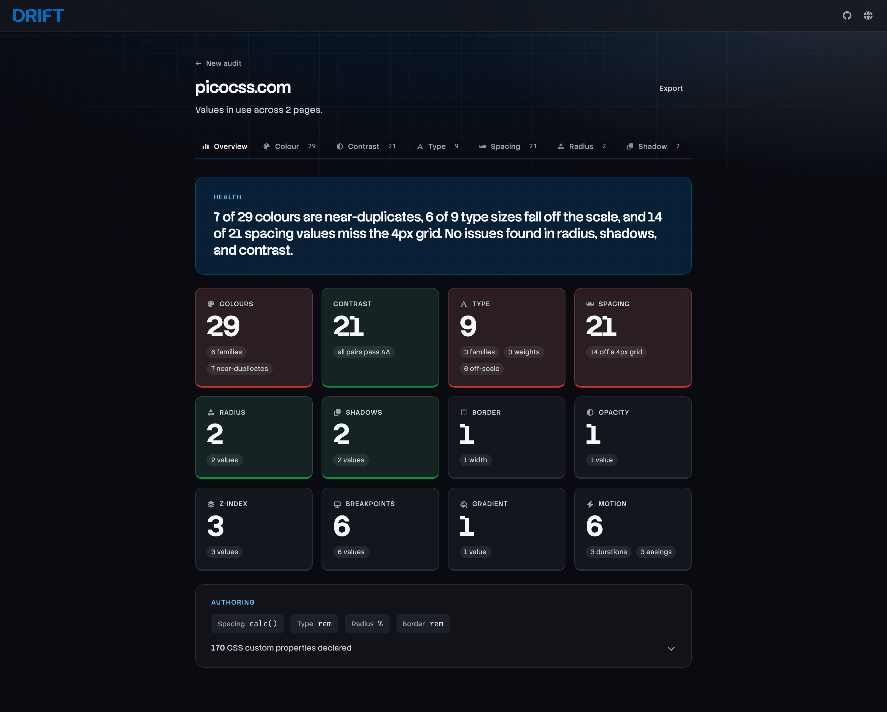

Each card is a way in: click Colour and you land on the colours, already scrolled to what the
card was counting. The counts come from the audit's own summary, so a card and the tab it
opens can never disagree.

---

## Colour

Every colour in use, grouped into hue families and ranked by how much of the site it carries.
Each swatch shows where it is used (text, background, border) and on how many pages.

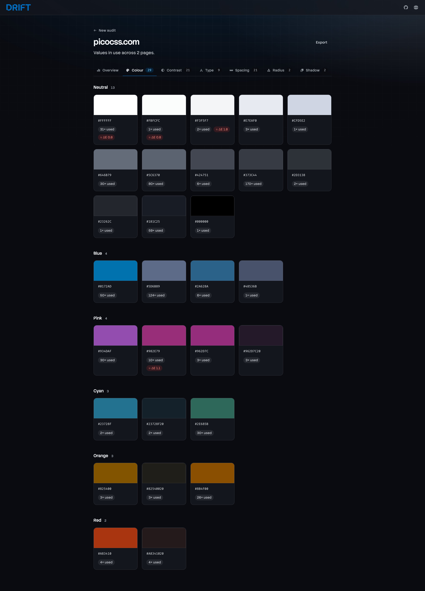

Near-duplicates are the finding here. Two colours within CIEDE2000 ΔE 2 are perceptually
indistinguishable: not a deliberate light/mid/dark step, which sits at ΔE 8 or more, but the
same colour written twice. Selecting a swatch opens a rail showing what it relates to:
opacity variants of the same base, and the near-duplicates it should probably merge with.

---

## Contrast

Every text/background pair on the site, evaluated against WCAG 2.1, worst first.

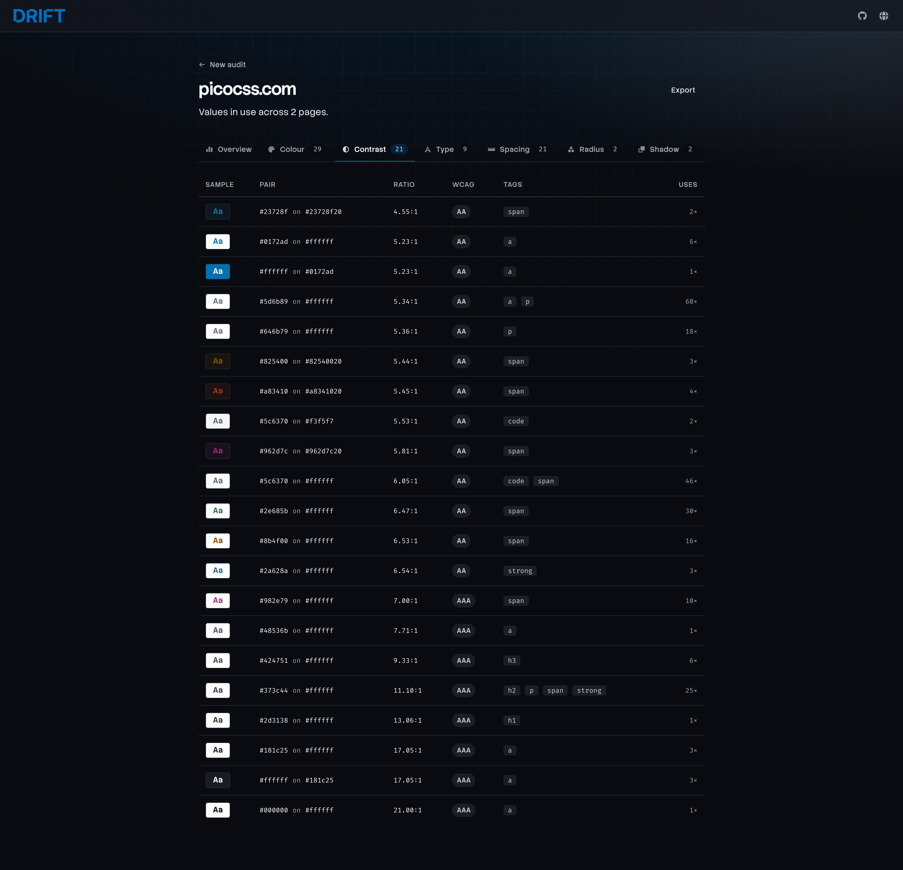

Contrast is measured against the background a reader sees: the nearest non-transparent
ancestor, with alpha composited. The element's own declared background is usually
`transparent`, so a check that used it would be measuring nothing. Muted text at 50% opacity on
a tinted panel is judged as it renders. Evaluated as authored, 50% black on white measures
18.9 and passes AAA; composited, it measures 3.5 and fails AA.

---

## Type

The families in use with their real usage counts, then the size ladder.

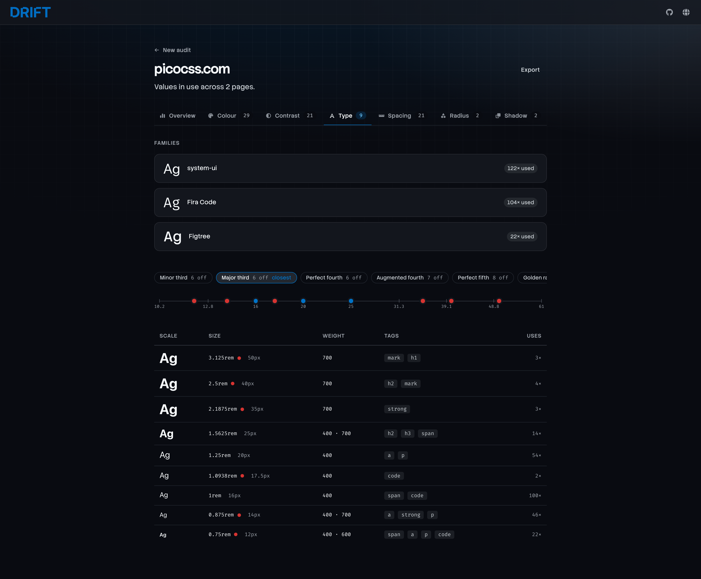

Sizes are plotted on a log axis against a modular scale's steps, and the ones that miss a step
sit between ticks in red. The scale is **selectable**: every named ratio is offered with its
own off-count, so the strip answers "which scale is this system actually on?".
The verdict stays pinned to the automatic best fit, so exploring a hypothesis never rewrites
the diagnosis.

Each row carries the authored unit alongside the computed pixels, because a rem-authored
scale and a px-authored one are different decisions and `getComputedStyle` discards the
difference.

---

## Spacing

Every spacing value, with a bar for scale and the element tags and CSS properties it appears
on.

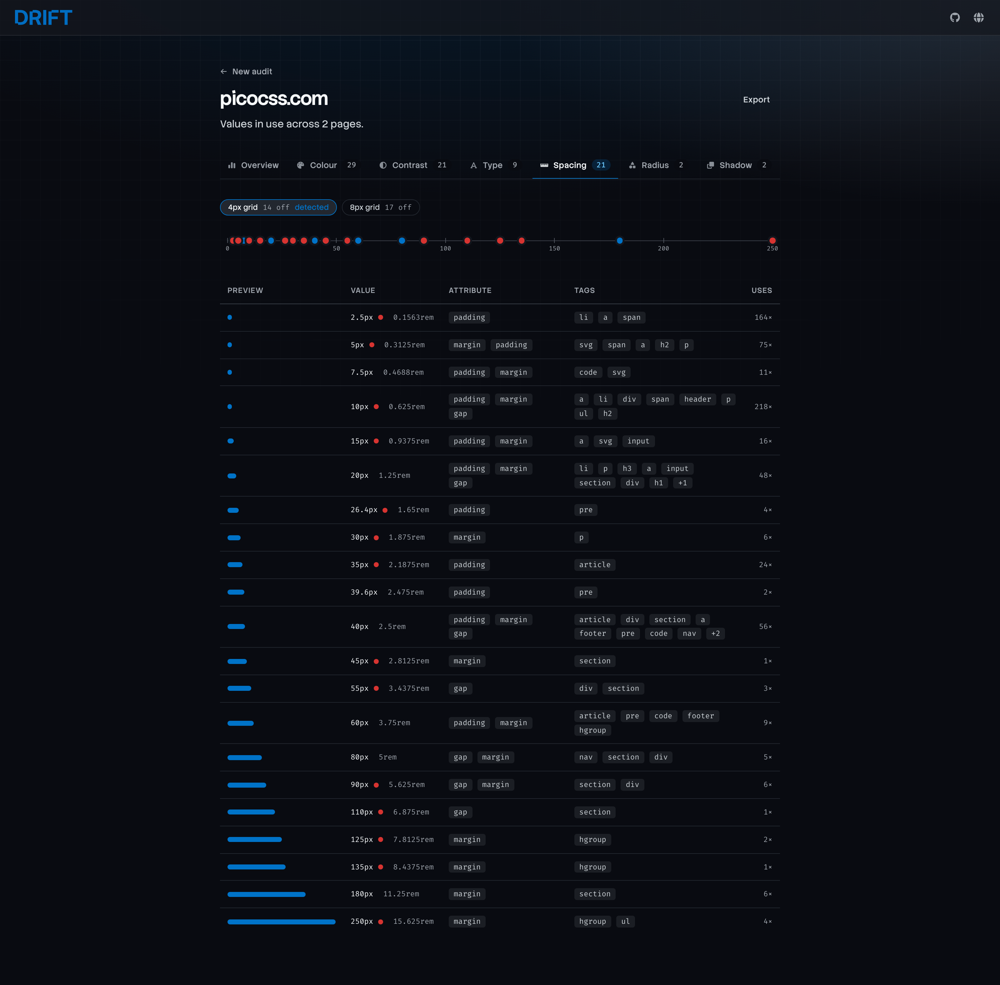

Measured against a 4px or 8px grid, selectable the same way as the type ratio. An 8px grid is
a subset of a 4px one, so "nothing misses 8" is the stronger statement and the default when it
holds. Values that miss the grid are marked inline.

---

## Radius, shadow and border

The three that usually hold, reported so you can see that they do.

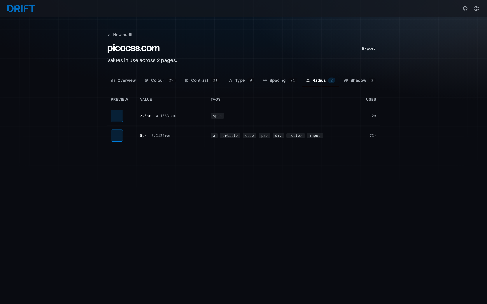
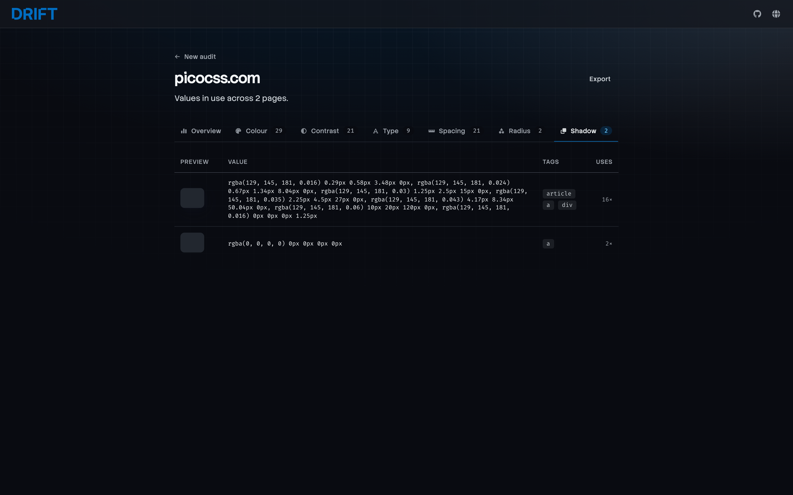

Radii within 1px of each other are flagged as near-duplicates. 4px beside 4.9px is a value
someone typed while meaning the one above it. Border widths use a finer 0.5px threshold,
because 1px against 1.5px is a real duplicate at that scale.

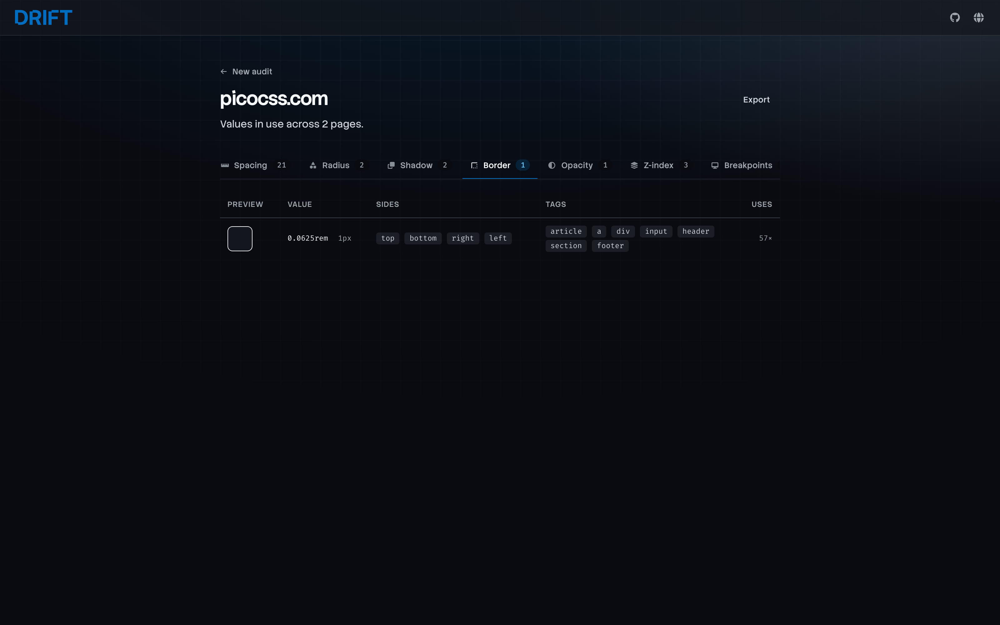

---

## The extended token set

The categories most audits skip. Drift hides here, where nobody looks.

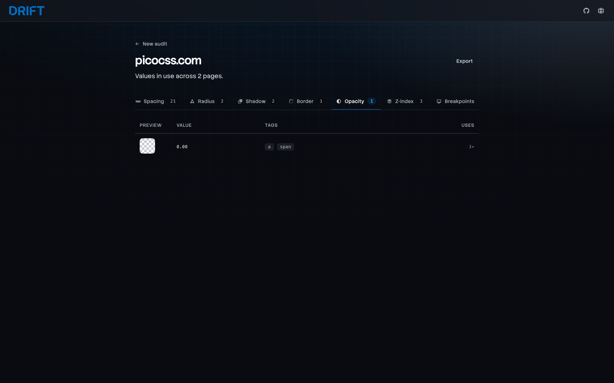
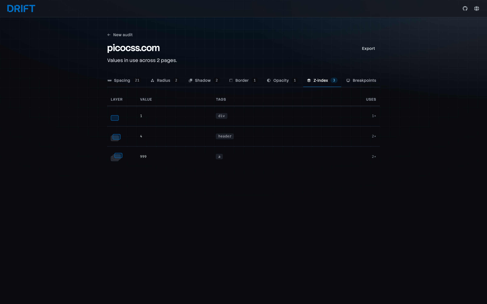

Z-index is rendered as a stacking ladder, so an ad-hoc set is visible as a shape. A set larger
than eight layers, or one containing a 9999, is called out on the health line. Both are the
signature of a value picked to win an argument with another value.

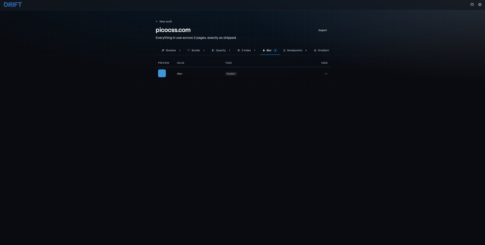
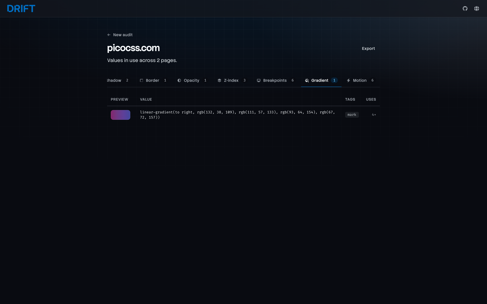

---

## Breakpoints and motion

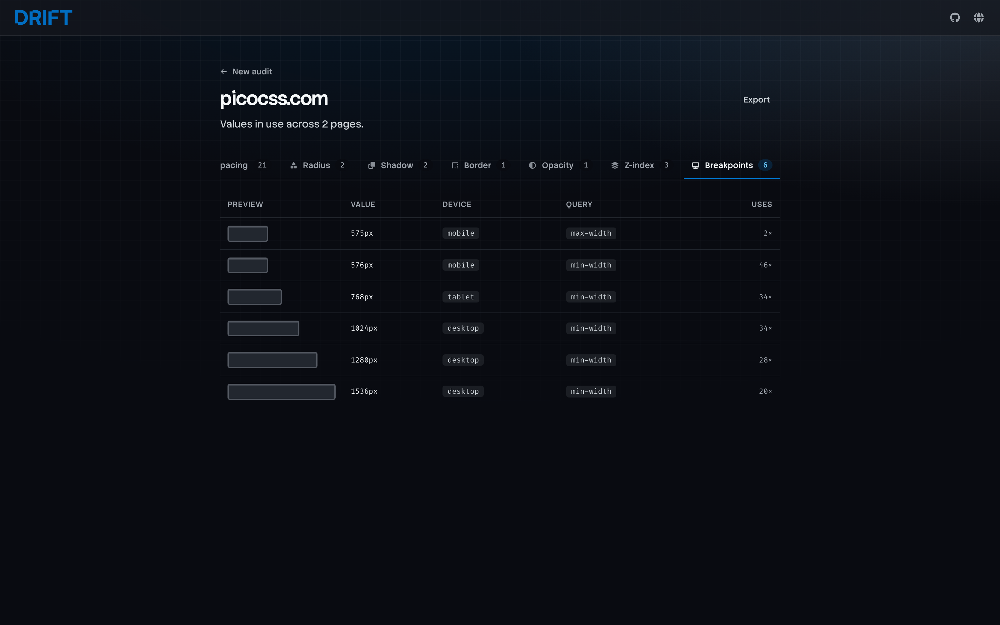

Breakpoints are read from the stylesheets' media queries, classified by device, and split by
whether they are `min-width` or `max-width`. A system that mixes both is usually two systems.

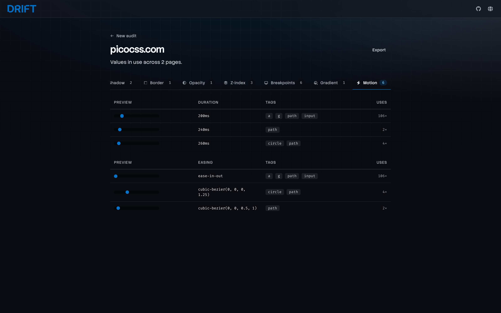

Durations and easings each animate their own specimen, because a cubic-bézier is not something
you can read as a number.

---

## Authored units

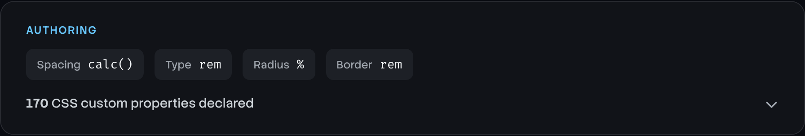

What the stylesheets actually say, per category, which the browser throws away. `1rem` and
`16px` compute identically and mean different things; this is the only place the distinction
survives the crawl.

---

## The export

The whole audit as one JSON artefact. It leads with the diagnosis (`health`, then `findings[]`
with severity and evidence, then `verdicts`, then the `rules` each number was measured
against) and carries the full inventory underneath.

The shape is built for a machine to read: assert on it, diff two runs to see what moved, or
hand it to a model and ask what to fix first. The rules block is what makes that possible,
since a count means nothing without the reference it was counted against. The export is
produced from the audit screen; no endpoint serves it yet, which is [issue #3](../../issues/3).
